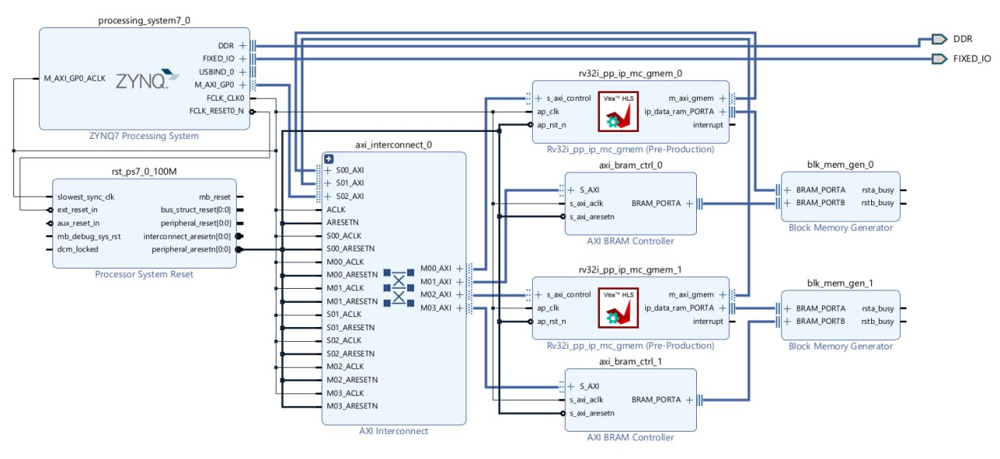
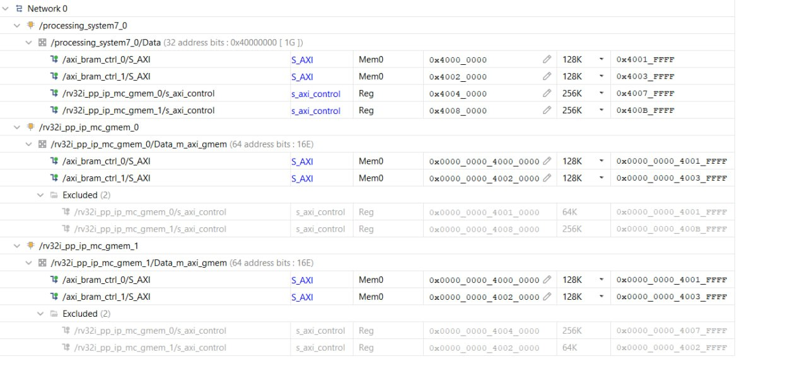
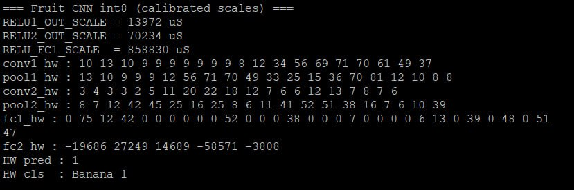
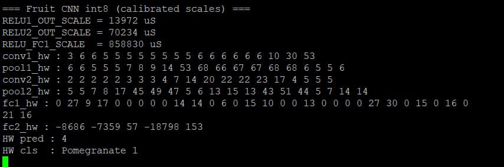

# 4-Core RV32I Processor System for Edge Machine Learning and CNN Inference

An FPGA-based 4-core RV32I soft-processor platform deployed on the AMD PYNQ-Z2 (Zynq-7020) FPGA board. The system accelerates integer machine learning models and int8 quantized Convolutional Neural Network (CNN) workloads using bare-metal parallel execution and mailbox-based synchronization.

---

## Overview

This repository contains the High-Level Synthesis (HLS) processor IP source code, hardware layout notes, bare-metal RISC-V worker firmware, ARM host drivers, and validation proofs for a 4-core RV32I soft-processor system. The platform executes machine learning workloads without operating system overhead or floating-point hardware requirements by leveraging post-training static int8 quantization.

### Core Workloads Executed

1. **Int8 Fruit CNN Classification (`FruitCNNSmall`)**: 5-class fruit image classification (Apple Red 1, Banana 1, Mango 1, Orange 1, Pomegranate 1) operating on 32x32 RGB inputs.
2. **MNIST Single-Layer Int8 Fully-Connected (FC)**: 784-input digit classification servicing batch inference.
3. **MNIST 2-Layer Multi-Layer Perceptron (MLP)**: 784 -> 64 -> 10 network supporting dual int8 and int32 output accumulation modes.

---

## Hardware Architecture

The system utilizes an ARM Cortex-A9 Processing System (PS) host controller alongside 4 independent lightweight RV32I soft cores instantiated on the FPGA fabric via Vitis High-Level Synthesis (HLS).

### System Specifications

- **Processor Cores**: 4x RV32I 4-stage in-order pipelined soft cores synthesized via Vitis HLS.
- **Interconnect**: AXI4 / AXI4-Lite shared interconnect.
- **Memory Subsystem**: Private BRAM window allocated per core (64 KiB BRAM per core).
- **Synchronization**: Hardware mailbox registers (`MB[0]` done flag, `MB[5]` job flag, CSR cycle and instruction counters).
- **Host Controller**: Zynq-7000 PS ARM Cortex-A9 managing initialization, data transfer, pooling operations, and UART output.

### Hardware Block Diagram



### BRAM Memory Partitioning

Memory base address for core $i$: `CORE_BASE(i) = 0x40000000 + i * 0x10000`

- `0x0000 - 0x1FFF`: Private stack space
- `0x2000 - 0x20FF`: Mailbox control structures
- `0x2100+`: Input buffers, weight matrices, bias vectors, and output activation arrays



---

## High-Level Synthesis (HLS) Processor IP Design

The core RV32I processing unit and multi-core top-level hardware pipeline are implemented in C++ using AMD Vitis HLS (`hls_code/`) and packaged as an IP Catalog block (`xc7z020clg400-1`).

### 4-Stage Pipelined RV32I Core Structure

The processor core is designed around a modular 4-stage in-order pipeline:

1. **Instruction Fetch (`fetch.cpp`, `fetch.h`)**: Retrieves 32-bit RISC-V instructions from the core instruction memory (IMEM) based on the Program Counter (PC).
2. **Instruction Decode & Immediate (`decode.cpp`, `immediate.cpp`, `type.cpp`)**: Decodes opcodes, `funct3`/`funct7` fields, extracts sign-extended immediate formats (R, I, S, B, U, J), and identifies execution control flags.
3. **Execute & Compute (`execute.cpp`, `compute.cpp`)**: Executes integer ALU operations (ADD, SUB, AND, OR, XOR, SLL, SRL, SRA, SLT, SLTU, branch decisions, and jump target calculations).
4. **Memory & Write-Back (`mem.cpp`, `wb.cpp`)**: Performs memory loads/stores (byte, half-word, word) and updates general-purpose registers (`x1`–`x31`).

### Multi-Core Top Level & Memory Configuration

- **Top-Level Entry (`multicore_pipeline_4s.cpp`, `multicore_pipeline_4s.h`)**: Instantiates parameterizable RV32I processing instances (`LOG_NB_IP = 2` for 4 cores) connected to shared memory spaces and AXI control interfaces.
- **Memory Parameters (`multicore_pipeline_4s.h`)**: Configures 128 KiB DMEM per core window (`LOG_DATA_RAM_SIZE = 17`) and 16 KiB IMEM per core window (`LOG_CODE_RAM_SIZE = 14`).
- **Simulation & Verification (`testbench_*.cpp`, `disassemble.cpp`, `emulate.cpp`)**: Includes C testbenches and disassembler trace tools to verify instruction execution correctness before RTL synthesis.

---

## Machine Learning & CNN Inference Pipeline

### Workload Partitioning Scheme

For convolution layers, work is partitioned across the 4 worker cores by output channel:

- **Conv1 (8 Output Channels)**: 2 channels processed per RV32I core.
- **MaxPool1**: Executed on ARM host.
- **Conv2 (16 Output Channels)**: 4 channels processed per RV32I core.
- **MaxPool2**: Executed on ARM host.
- **FC Layers**: Executed with soft-float dequantization on ARM host.

---

## Hardware Proof & Execution Results

All models were executed and verified on physical PYNQ-Z2 FPGA hardware via UART serial interface (115200 baud).

### 1. Fruit CNN Inference Proofs

#### Banana 1 Test Image & Hardware Result


```text
=== Fruit CNN int8 (calibrated scales) ===
RELU1_OUT_SCALE = 13972 uS
RELU2_OUT_SCALE = 70234 uS
RELU_FC1_SCALE  = 858830 uS
conv1_hw : 10 13 10 9 9 9 9 9 9 9 8 12 34 56 69 71 70 61 49 37 
pool1_hw : 13 10 9 9 9 12 56 71 70 49 33 25 15 36 70 81 12 10 8 8 
conv2_hw : 3 4 3 3 2 5 11 20 22 18 12 7 6 6 12 13 7 8 7 6 
pool2_hw : 8 7 12 42 45 25 16 25 8 6 11 41 52 51 38 16 7 6 10 39 
fc1_hw   : 0 75 12 42 0 0 0 0 0 52 0 0 0 38 0 0 0 7 0 0 0 0 6 13 0 39 0 48 0 51 47 
fc2_hw   : -19686 27249 14689 -58571 -3808 
HW pred : 1 
HW cls  : Banana 1
```



#### Pomegranate 1 Test Image & Hardware Result


```text
=== Fruit CNN int8 (calibrated scales) ===
RELU1_OUT_SCALE = 13972 uS
RELU2_OUT_SCALE = 70234 uS
RELU_FC1_SCALE  = 858830 uS
conv1_hw : 3 6 6 5 5 5 5 5 5 5 5 6 6 6 6 6 6 10 30 53 
pool1_hw : 6 6 5 5 5 7 8 9 14 53 68 66 67 67 68 68 6 5 5 6 
conv2_hw : 2 2 2 2 2 3 3 3 4 7 14 20 22 22 23 17 4 5 5 5 
pool2_hw : 5 5 7 8 17 45 49 47 5 6 13 15 13 43 51 44 5 7 14 14 
fc1_hw   : 0 27 9 17 0 0 0 0 0 14 14 0 6 0 15 10 0 0 13 0 0 0 0 27 30 0 15 0 16 0 21 16 
fc2_hw   : -8686 -7359 57 -18798 153 
HW pred : 4 
HW cls  : Pomegranate 1
```



---

## Repository Directory Tree

```
CNN_on_Multicore_RV32I/
├── .gitignore                 # Exclusion rules for build artifacts
├── README.md                  # System description, HLS architecture, and execution proof
│
├── hls_code/                  # Vitis HLS C++ source for the 4-core RV32I processor IP
│   ├── multicore_pipeline_4s.cpp # Top-level HLS entry point & multi-core pipeline orchestration
│   ├── multicore_pipeline_4s.h   # Multi-core configuration parameters (cores, IMEM/DMEM sizes)
│   ├── multicore_pipeline_4s.cfg # Vitis HLS project configuration & synthesis target
│   ├── vitis-comp.json        # Vitis HLS component metadata
│   ├── fetch.cpp / decode.cpp # 4-stage pipeline execution modules
│   ├── execute.cpp / mem.cpp  # ALU, memory access, & write-back units
│   ├── immediate.cpp / type.cpp# Instruction decoding & immediate formatting helpers
│   ├── rv32i_pp_ip.cpp        # Single-core 4-stage RV32I pipeline core logic
│   ├── disassemble.cpp        # RISC-V disassembler helper for simulation trace
│   ├── emulate.cpp            # Core state emulator for C simulation
│   └── testbench_*.cpp        # HLS simulation testbenches
│
├── docs/                      # Proof screenshots and architectural block diagrams
│   └── images/                # Hardware execution logs and memory diagrams
│
├── firmware/                  # Bare-metal C worker firmware for RV32I cores
│   ├── common/                # Shared CRT0 startup, linker script, and bin2carray utility
│   ├── cnn_conv_core/         # 2D Convolution worker service
│   ├── cnn_fc_core/           # Fully-Connected worker service
│   ├── fc_int8_core/          # Int8 FC unit service
│   ├── fc_mnist_core/         # MNIST FC service with CSR cycle/instret performance counters
│   └── fc_mlp_core/           # 2-Layer MLP worker service
│
├── host/                      # ARM Cortex-A9 host orchestration applications
│   ├── fruit_cnn_inference/   # Fruit CNN controller and model weight headers
│   ├── mnist_single_layer/    # MNIST CNN host drivers
│   ├── mnist_fc_single_layer/ # Continuous service-mode MNIST driver
│   ├── mnist_mlp_two_layer/   # 2-Layer MLP host driver
│   └── int8_fc_test/          # Hardware verification test bench
│
├── hardware/                  # Vivado platform files
│   └── platform/              # Vitis platform recreation TCL script
│
└── scripts/                   # Performance and analysis scripts
    ├── generate_charts.py
    └── analyze_template.py
```

---

## Build and Execution Guide

### Prerequisites

- AMD Vivado Design Suite 2022.1
- AMD Vitis Unified Software Platform / Vitis HLS 2022.1
- RISC-V GNU Toolchain (`riscv64-unknown-elf-gcc` with `-march=rv32i -mabi=ilp32`)
- PYNQ-Z2 FPGA Board

### 1. Synthesize RV32I Processor IP using Vitis HLS (Optional)

To synthesize the processor core IP from source C++ code:

```bash
cd hls_code
vitis_hls -f multicore_pipeline_4s.cfg
```

Alternatively, launch **Vitis HLS 2022.1**, import `hls_code/vitis-comp.json`, run **C Simulation** / **C Synthesis**, and export the generated IP Catalog (`.zip` / IP folder) for Vivado IP Integrator.

### 2. Build Bare-Metal RISC-V Worker Firmware

```bash
cd firmware
riscv64-unknown-elf-gcc -march=rv32i -mabi=ilp32 -O2 -nostdlib -nostartfiles \
  -T common/link.ld common/crt0_minimal.s cnn_conv_core/cnn_conv_core_service.c \
  -o cnn_conv_core.elf -lgcc

riscv64-unknown-elf-objcopy -O binary cnn_conv_core.elf cnn_conv_core.bin
python common/bin2carray.py cnn_conv_core.bin cnn_conv_core.hex
```

### 3. Build and Launch ARM Host Application

1. Open Vitis 2022.1 and import the hardware platform generated from `hardware/platform/platform.tcl`.
2. Build the target application located in `host/fruit_cnn_inference/main.c`.
3. Connect the PYNQ-Z2 FPGA board via USB-UART and program the FPGA bitstream.
4. Launch a serial terminal emulator at `115200` baud to view inference results.


