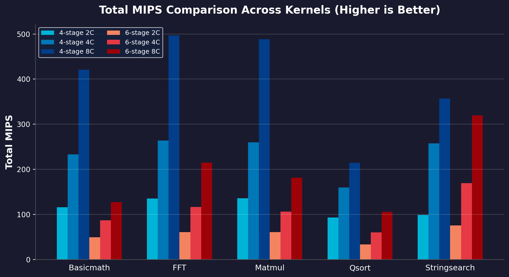
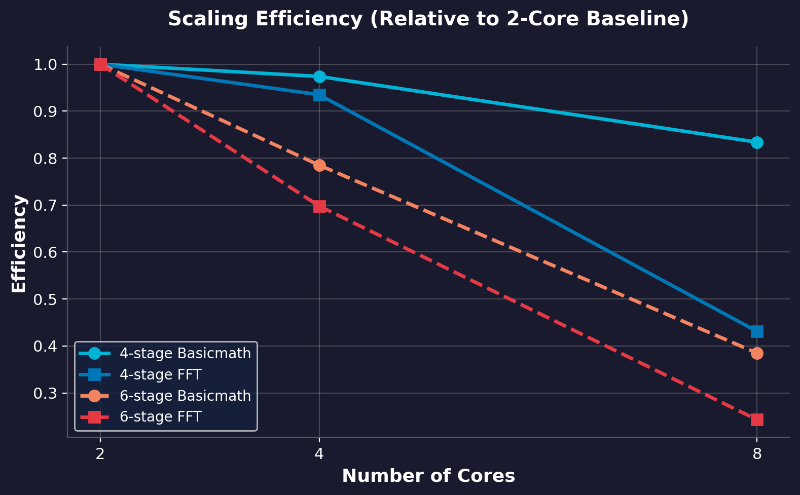

# Comparative Performance Analysis of 4-Stage and 6-Stage RISC-V Cores in a Multicore FPGA System

A controlled hardware benchmarking and multicore scaling evaluation of RV32I soft processors on the AMD PYNQ-Z2 (Zynq-7020) FPGA platform, featuring an int8-quantized Convolutional Neural Network (CNN) deployment for real-time edge classification.

---

## Authors & Citation

- **Molik Rajvanshi** (Roll No. 23UEC575)
- **Ujjawal Khatri** (Roll No. 23UEC635)
- **Advisor**: Dr. Abhishek Sharma, Assistant Professor
- **Institution**: Department of Electronics and Communication Engineering, The LNM Institute of Information Technology (LNMIIT), Jaipur
- **Session**: Academic Session 2024–2025

---

## Abstract

This repository presents the implementation, multicore scaling, and hardware benchmarking of two RV32I soft-core processor families on an AMD PYNQ-Z2 (Zynq-7020) FPGA:
1. A 4-stage in-order pipelined RV32I processor scaled across 2, 4, and 8-core configurations.
2. A 6-stage multicycle RV32I soft-processor core.

All configurations run bare-metal workloads without library dependency, utilizing a unified mailbox synchronization protocol and BRAM memory partitioning. Experimental benchmarking using MiBench integer workloads (Basicmath, Bitcount, Qsort, Stringsearch, FFT, IFFT, Matmul) demonstrates that the 4-stage pipelined architecture achieves superior performance and hardware efficiency across all core counts, reaching up to 5.98x speedup on 8 cores while consuming 28,591 LUTs and 1.63 W total power (versus 43,731 LUTs and 1.69 W for the 6-stage core).

As a practical application, a lightweight int8 quantized Convolutional Neural Network (`FruitCNNSmall`, ~34.3K parameters) is deployed on the 4-core system for 5-class fruit image classification, achieving 100% test accuracy on FPGA hardware.

---

## System Architecture

The overall hardware framework integrates the Zynq Processing System (PS) as host controller communicating with independent RV32I worker cores over an AXI interconnect.

### Block Diagram


### Memory Organization

Each RV32I worker operates within a private BRAM window. Data BRAM is partitioned equally across cores:
- **2 Cores**: 128 KiB BRAM per core
- **4 Cores**: 64 KiB BRAM per core
- **8 Cores**: 32 KiB BRAM per core

Address window base: `CORE_BASE(i) = 0x40000000 + i * WINDOW_SIZE`


---

## Performance Comparison (MiBench Benchmarks)

All evaluations use post-implementation timing closure frequencies ($F_{max}$).

### Complete Performance Metrics Table

| Kernel | Core Family | Cores ($N$) | Frequency (MHz) | Parallel IPC | Total MIPS | Time (s) | Speedup | Efficiency |
|---|---|---|---|---|---|---|---|---|
| **Basicmath** | 4-Stage | 2 | 81.76 | 1.419 | 116.0 | 0.0216 | 1.000 | 1.000 |
| **Basicmath** | 4-Stage | 4 | 82.19 | 2.835 | 233.0 | 0.0110 | 1.948 | 0.974 |
| **Basicmath** | 4-Stage | 8 | 80.77 | 5.209 | 420.7 | 0.0066 | 3.336 | 0.834 |
| **Basicmath** | 6-Stage | 2 | 80.40 | 0.609 | 49.0 | 0.0555 | 1.000 | 1.000 |
| **Basicmath** | 6-Stage | 4 | 76.71 | 1.131 | 86.8 | 0.0371 | 1.569 | 0.785 |
| **Basicmath** | 6-Stage | 8 | 72.69 | 1.750 | 127.2 | 0.0399 | 1.541 | 0.385 |
| **FFT** | 4-Stage | 2 | 81.76 | 1.652 | 135.1 | 0.0174 | 1.000 | 1.000 |
| **FFT** | 4-Stage | 4 | 82.19 | 3.211 | 263.9 | 0.0092 | 1.870 | 0.935 |
| **FFT** | 4-Stage | 8 | 80.77 | 6.151 | 496.8 | 0.0102 | 1.724 | 0.431 |
| **FFT** | 6-Stage | 2 | 80.40 | 0.756 | 60.8 | 0.0451 | 1.000 | 1.000 |
| **FFT** | 6-Stage | 4 | 76.71 | 1.519 | 116.5 | 0.0340 | 1.395 | 0.698 |
| **FFT** | 6-Stage | 8 | 72.69 | 2.953 | 214.7 | 0.0513 | 0.973 | 0.243 |
| **Matmul** | 4-Stage | 8 | 80.77 | 6.046 | 488.3 | 0.0283 | 13.589 | 3.397 |

### Hardware Resource & Power Consumption

Post-implementation FPGA utilization on PYNQ-Z2 (Zynq-7020):

| Family | Cores ($N$) | LUT | FF | BRAM | Power (W) |
|---|---|---|---|---|---|
| 4-Stage Pipeline | 2 | 5,921 | 7,556 | 65 | 1.446 |
| 4-Stage Pipeline | 4 | 11,048 | 14,003 | 66 | 1.475 |
| 4-Stage Pipeline | 8 | 28,591 | 33,341 | 68 | 1.630 |
| 6-Stage Multicycle | 2 | 11,304 | 11,482 | 98 | 1.559 |
| 6-Stage Multicycle | 4 | 22,155 | 22,111 | 132 | 1.605 |
| 6-Stage Multicycle | 8 | 43,731 | 43,357 | 136 | 1.690 |

### Benchmark Visualization





---

## Edge AI Application: Int8 CNN Fruit Classification

To validate real-world application performance, a lightweight int8 quantized Convolutional Neural Network (`FruitCNNSmall`, 34,357 parameters) was implemented for 5-class fruit classification (Apple Red 1, Banana 1, Mango 1, Orange 1, Pomegranate 1).

### Model Topology & Heterogeneous Distribution

| Layer | Type | Output Shape | Execution Unit | Computation |
|---|---|---|---|---|
| Conv1 | Conv2d (3->8, k3p1) | (8, 32, 32) | 4x RV32I Workers (2 ch/core) | Data-parallel int8 MAC |
| MaxPool1 | MaxPool2d (2x2) | (8, 16, 16) | ARM Cortex-A9 Host | Hardware comparison |
| Conv2 | Conv2d (8->16, k3p1) | (16, 16, 16) | 4x RV32I Workers (4 ch/core) | Data-parallel int8 MAC |
| MaxPool2 | MaxPool2d (2x2) | (16, 8, 8) | ARM Cortex-A9 Host | Hardware comparison |
| FC1 | Linear (1024->32) | (32,) | ARM Cortex-A9 Host | Int8 matrix vector |
| FC2 | Linear (32->5) | (5,) | ARM Cortex-A9 Host | Float Logits |

### FPGA Hardware Execution Results

All five classes were classified correctly on FPGA hardware.

#### Banana 1 Classification

  


#### Pomegranate 1 Classification

  


---

## Repository Structure

```
RISCV-Multicore-FPGA-CNN/
├── docs/                      # Technical documentation, PDF report, images, and charts
│   ├── report.pdf             # Full BTP project report PDF
│   ├── presentation.pptx      # BTP presentation slides
│   └── images/                # Architecture diagrams, result logs, and performance charts
├── firmware/                  # Bare-metal RISC-V C source code for worker cores
│   ├── common/                # Shared CRT0 startup assembly, linker script, hex tool
│   ├── cnn_conv_core/         # 2D Convolution int8 worker service
│   ├── cnn_fc_core/           # Fully-Connected int8 worker service
│   ├── fc_int8_core/          # Int8 FC unit service
│   ├── fc_mnist_core/         # MNIST FC service with CSR cycle/instret counters
│   └── fc_mlp_core/           # 2-layer MLP worker service
├── host/                      # Standalone ARM Cortex-A9 driver applications
│   ├── fruit_cnn_inference/   # End-to-end Fruit CNN inference host code and headers
│   ├── mnist_single_layer/    # MNIST CNN host applications
│   ├── mnist_fc_single_layer/ # MNIST FC service-mode host driver
│   ├── mnist_mlp_two_layer/   # MNIST 2-layer MLP host controller
│   └── int8_fc_test/          # Hardware verification testbench
├── hardware/                  # Vivado platform scripts and architectural notes
│   └── platform/              # Vitis platform recreation TCL scripts
├── scripts/                   # Utility scripts for chart generation and PPT analysis
├── .gitignore                 # Exclusion rules for build binaries and tool logs
├── LICENSE                    # MIT License
└── README.md                  # Main repository documentation
```

---

## How to Build and Run

### Prerequisites

- AMD Vivado Design Suite 2022.1
- AMD Vitis Unified Software Platform 2022.1
- RISC-V GNU Toolchain (`riscv64-unknown-elf-gcc` with `-march=rv32i -mabi=ilp32`)
- PYNQ-Z2 FPGA Board

### 1. Compile RISC-V Worker Firmware

```bash
cd firmware
riscv64-unknown-elf-gcc -march=rv32i -mabi=ilp32 -O2 -nostdlib -nostartfiles \
  -T common/link.ld common/crt0_minimal.s cnn_conv_core/cnn_conv_core_service.c \
  -o cnn_conv_core.elf -lgcc

riscv64-unknown-elf-objcopy -O binary cnn_conv_core.elf cnn_conv_core.bin
python common/bin2carray.py cnn_conv_core.bin cnn_conv_core.hex
```

### 2. Build and Flash Host Application

1. Import `hardware/platform/platform.tcl` into Vitis to regenerate the PYNQ-Z2 hardware platform.
2. Build `host/fruit_cnn_inference/main.c` targeted for `ps7_cortexa9_0`.
3. Connect PYNQ-Z2 board via USB-UART and micro-USB JTAG.
4. Open serial terminal at `115200` baud.
5. Program FPGA bitstream and run the host application.

---

## License

This project is licensed under the MIT License - see the [LICENSE](LICENSE) file for details.
